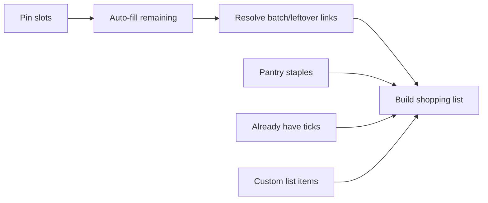
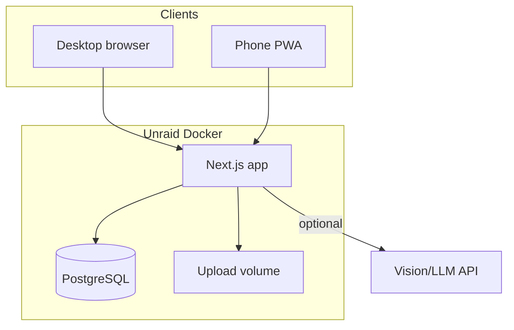

# Recipe Book — Master Plan

Living brief for the household food app. Implementation should be checked against this document so nothing in the original request is lost.

---

## 1. Product vision

**Name:** Recipe Book.

A self-hosted app for one or more **households**. Everyone in a household shares the same recipes, meal plans, and shopping lists. Primary idea: build a **family recipe archive** you can keep for years and later hand down (export the whole library), while day-to-day use is planning the week’s **main evening meals** from *your* recipes only, generating a shopping list, and cooking at the right scale. Works as a full web app and as a phone “app” via PWA (install / pin to home screen). Runs on Unraid via Docker Compose; easy pull-to-update from GitHub/GHCR.

**Units:** default UI and new-recipe hints use **metric** (g, kg, ml, l). Recipes that use cups, oz, lb, or other imperial/US measures are stored and shown as entered — no forced conversion. Scaling multiplies the stated quantity in whatever unit the line uses.

**Out of scope for v1:** approx meal pricing / per-person budget (design data model so it can be added later). Per-person dietary allergy blocking (explicitly deferred).

---

## 2. Users and households

| Concept | Behaviour |
|--------|-----------|
| **User** | Account (email + password). Can belong to one or more households. |
| **Household** | Shared library: recipes, tags, meal plans, shopping lists, pantry staples. |
| **Roles** | `owner` (invite/remove members, household settings) and `member` (full use of recipes/plans/lists). |
| **Invites** | Owner creates invite link/code; joining user sees the shared library immediately. |

Wife pins a meal for next week → husband sees it on the same plan. No private recipe silos in v1.

---

## 3. Core features (must ship)

### 3.1 Recipes

- Manual create/edit: title, description, ingredients (qty, unit, name, optional notes), method steps, servings, prep time, cook time, photos, categories, custom tags.
- **Categories** (auto + editable): e.g. main, soup, dessert, side, breakfast, snack. Auto-suggest on save/import from title/ingredients/method; user can override.
- **Custom tags**: freeform household tags (batch cooking, speedy, packups, entertaining, etc.).
- **AI tag suggestions (on first add)**: when a recipe is created or imported, call the import/LLM API to suggest tags and category from the title, ingredients, and method. Suggestions are **pre-selected but fully editable** — add, remove, or type custom tags before or after save. Re-run “suggest tags” later from the recipe edit screen if wanted.
- **Veg / “5 a day” estimate**: on the same analysis pass, count vegetable (and fruit) contributions toward UK-style “5 a day” portions for a typical serving of the dish. Store a numeric `veg_portions` (e.g. `3`) and surface a derived tag such as **“3 of your 5 a day”**. Heuristic + AI assist; user can override the number. Filterable in library and usable as a meal-plan preference (e.g. favour higher veg weeks) without a full nutrition engine.
- **Search/filter**: by ingredient text, category, tag, veg portions, time, and free text.
- **Scaling**: view/cook mode scales ingredient quantities from stored servings (e.g. 4 → 6). Method text stays unchanged; only quantities scale. Meal plan can store a target serving size per slot.
- **Photos**: one or more images per recipe; stored on disk volume, served by the app.
- **Share by email (no app link)**: from a recipe, send to a friend/family address as a **self-contained** email — plain-text body (title, times, ingredients scaled if chosen, method) plus optional **PDF attachment**. Does **not** include a link to your self-hosted app. Requires SMTP env on the server; if SMTP is unset, offer **Download PDF** / **Copy text** so sharing still works.
- **Per-user ratings (1–5)**: each household member can rate a recipe out of 5 (stars). Ratings are personal but the **household average** (and optionally “my rating”) is shown on the recipe. Unrated recipes get a neutral mid weight so new dishes still appear.
- **Library export (family archive)**: household owner/members can export the **entire recipe library** for backup or handing down — **CSV** (structured: titles, times, servings, ingredients, method, tags, veg portions, avg rating) and/or a **PDF pack** (one recipe per section/page, printable cookbook-style). Images included in PDF where practical; CSV may reference image filenames. Export is offline-portable — no dependency on the running app.

### 3.2 Import from URL

- Paste URL → fetch page → extract title, ingredients, method, times, servings, image when present.
- **Priority sites**: BBC Good Food / Good Food structured data first; then generic **schema.org Recipe / JSON-LD** (covers most modern recipe sites); HTML heuristics as last resort.
- User reviews/edits extracted draft before saving into the household library.
- API key(s) provided via env when a paid LLM fallback is needed for messy pages (optional path; structured data is preferred).

### 3.3 Import from photo

- Upload/camera photo of a printed or handwritten recipe.
- Vision/LLM API (user-supplied key) extracts structured recipe fields.
- Same review-before-save flow as URL import.

### 3.4 Meal planning

- **Configurable meal types** per household (defaults: evening main only; can add breakfast/lunch later without schema rewrite).
- **Week view** (Mon–Sun or household week-start setting).
- **How many meals this week**: e.g. plan 5 slots; leave 2 as “takeaway / eating out / skip” (non-recipe placeholders that do not feed the shopping list).
- **Pin**: user pins specific recipes to specific slots; those stay fixed.
- **Auto-fill**: fills remaining empty recipe slots from the household library using **parameters**, e.g.:
  - 2 vegetarian, 1 fish, rest any
  - respect category/tag filters if provided
  - optional “plenty of veg” bias using stored `veg_portions`
  - **rating weight**: higher household-average (or combined) scores are more likely to be chosen when filling blanks
- **No week-to-week repeats (default)**: a recipe used in the previous week’s plan must **not** be auto-filled again the following week. Extendable to “not in the last N weeks” (default N = 1). **Exception:** recipes explicitly tagged (e.g. `ok to repeat` / household flag `allow_weekly_repeat`) may be selected again. Manual pin always wins — you can pin a recent meal if you want it anyway.
- **No invented recipes** — only recipes already in the household DB.
- Pins + constraints + leftovers (below) are applied in one pass; user can re-roll unpinned slots.

### 3.5 Batch cooking and leftovers

Model cook events separately from eat slots:

- Tag or flag recipes as suitable for batch / leftovers.
- When placing a batch recipe: choose **cook day** and **how many meals it covers** (e.g. cook Sunday, eat Sunday + Tuesday).
- Linked leftover slots show the same dish, marked “leftovers,” and **do not** add ingredients again to the shopping list.
- Scaling: ingredients are scaled once for **total portions across the cook + leftover eats** (or an explicit “batch yield” servings field on the plan entry).
- Shopping list groups under the cook day, not each leftover day.

### 3.6 Shopping list

- Generated from the week’s meal plan (scaled ingredients, batch-aware, skip non-recipe days).
- **Aggregate across the week**: the same ingredient must appear **once**, with quantities **summed**. Example: two meals that each need chicken breast → one line (“chicken breast”) with the combined amount (after per-meal scaling), not two separate lines. Match on normalized ingredient name + compatible unit; convert obvious unit pairs where safe (e.g. 500g + 0.5kg → 1kg). If units conflict and cannot be merged safely (e.g. “2 breasts” vs “400g”), keep separate lines or one line with a clear note so the user can resolve.
- **Pantry staples**: household-managed list (oil, salt, pepper, etc.) excluded by default; user can still add oil manually if they’ve run out.
- **Already have**: tick items off as “we have this” before shopping (distinct from “bought while shopping”). “Already have” items behave like checked: they leave the active list and sit in the greyed section (or a clear sub-label) so the active aisle list stays short.
- **In-store check-off**: as you shop, tick items; they **animate/move down** into a **greyed “Got it” section underneath** the active list (not deleted). Untick restores them to the active list immediately.
- **Delete with undo**: removing a line (custom or generated) does not hard-wipe without recovery — soft-delete or an **Undo** snackbar, plus a way to restore from the greyed/removed area so an accidental delete can be put back.
- **Custom lines**: free-text extras (toilet roll, wine, etc.) — not merged into recipe-generated rows unless the user chooses. Same check-off / greyed / undo behaviour.
- Mobile-first for supermarket use; sync so either household member ticking updates the shared list.

### 3.7 Sync and clients

- Single responsive web app + **PWA** (installable, offline shell for recent views where practical; authoritative data always from server).
- One backend = seamless sync across phone and desktop for the household.

### 3.8 Ratings and selection weight (detail)

- Table `recipe_ratings` (`user_id`, `recipe_id`, `score` 1–5, unique per user/recipe).
- Auto-fill score = f(avg rating, veg bias if enabled, random jitter) among **eligible** recipes (constraints + not used in last N weeks unless `allow_weekly_repeat`).
- UI: star control on recipe detail; optional sort library by rating.

---

## 4. Future (remember, do not build in v1)

- Approx **ingredient/meal pricing** and **cost per person** toward a weekly budget.
- Keep optional `unit_cost` / price-source fields out of UI but avoid schema choices that make this painful later (normalized ingredient names help).

---

## 5. Technical architecture (locked defaults)

Chosen for Unraid Docker simplicity, one codebase for web+PWA, and multi-user households. **Development is local-first** — you should not need the full Unraid/Docker stack to build and try features day to day.

| Layer | Choice |
|-------|--------|
| App | **Next.js** (App Router) full-stack TypeScript — UI + API routes/server actions |
| DB | **PostgreSQL 16** (same engine locally and in production) |
| Auth | Email/password sessions (e.g. Auth.js / Better Auth); household membership checks on every query |
| Files | Local folder in dev (`./data/uploads`); volume `/data/uploads` in Docker |
| Import URL | JSON-LD / schema.org Recipe parser; BBC Good Food tuned first; optional LLM fallback via env key |
| Import photo | Vision-capable API (OpenAI or compatible) via `IMPORT_API_KEY` env |
| AI tags / veg | Same API key: suggest tags + estimate `veg_portions` / “N of your 5 a day” on add |
| Email share | SMTP (`SMTP_HOST`, etc.) + PDF generation (e.g. server-side PDF lib); text body always |
| Local dev | Node 22+ on the Mac: `npm install` → `npm run dev` → open `http://localhost:3000`. Migrations and seed via npm scripts. `.env.local` for secrets. |
| Local DB | Postgres via **Homebrew** (`brew services start postgresql@16`) **or** optional `docker compose up db` only if you prefer not to install Postgres — the **app itself runs on the host**, not inside Docker, while we build. |
| Deploy | **Docker Compose**: `app` + `db`; named volumes for postgres + uploads (Unraid / production) |
| Updates | Prebuilt image on **GHCR** from GitHub Actions; Unraid: pull new tag / `compose pull && up -d` |
| Reverse proxy | Works behind Unraid SWAG/NPM; env for public URL / HTTPS |

### 5.1 Data model (essentials)

- `users`, `households`, `household_members`, `invites`
- `recipes` (includes `veg_portions` nullable int; `allow_weekly_repeat` bool default false; category_id), `recipe_ingredients`, `recipe_steps`, `recipe_images`
- `categories`, `tags`, `recipe_tags` (AI-suggested tags become normal tags once accepted)
- `recipe_ratings` (per user, 1–5)
- `pantry_staples`
- `meal_plans` (week + household), `meal_plan_slots` (date, meal_type, status: recipe | leftover | skip/out, recipe_id, servings, pin, link to cook slot)
- `shopping_lists`, `shopping_list_items` (source: generated | custom; flags: pantry_excluded, already_have, checked, soft_deleted; checked/already_have drive active vs greyed “Got it” section)

All recipe/plan/list queries scoped by `household_id`.

### 5.2 Config / secrets (env)

- `DATABASE_URL`, `AUTH_SECRET`, `NEXT_PUBLIC_APP_URL`
- `IMPORT_API_KEY` (photo + messy URL fallback + tag/veg suggestions) — you supply when we wire import
- `SMTP_HOST`, `SMTP_PORT`, `SMTP_USER`, `SMTP_PASS`, `SMTP_FROM` — for recipe email share
- No secrets in git; sample `.env.example` for Unraid template

---

## 6. UX outline

1. **Library** — search, filters, add manual / from URL / from photo  
2. **Recipe detail** — scale servings, tags, veg “N of 5”, **stars (my rating)**, times, cook mode, Share, allow-weekly-repeat flag  
3. **Plan** — week grid, pin, skip/out, constraints (veg bias, rating weight, no-repeat), auto-fill, batch “covers N meals”  
4. **Shop** — active list on top; ticked items sink to greyed “Got it” below; untick / undo restore; staples, already-have, custom add  
5. **Household** — members, invites, meal types, week start, pantry staples, **Export library** (CSV / PDF pack)  

Mobile-first layouts for Plan and Shop (most used on phone).

---

## 7. Deployment & sharing

### Local development (default while building)

- Open the project in Cursor; run the Next.js app on the host — **no full Docker stack required**.
- One-time: Node 22+, Postgres 16 (Homebrew or db-only compose), copy `.env.example` → `.env.local`.
- Daily loop: `npm run dev`, edit, refresh browser. Dockerfiles stay in repo for later Unraid, not for day-to-day coding.
- Optional later: `docker compose up` to smoke-test the production image before deploying to Unraid.

### Production / Unraid / sharing

- GitHub repo with `docker-compose.yml`, `Dockerfile`, Unraid-oriented README (ports, volumes, env).
- CI builds and pushes `ghcr.io/<you>/recipe-book:latest` (and version tags).
- Others clone compose file + set env; same update path.
- First release: single-household happy path + invite second user; then harden import parsers.

---

## 8. Delivery phases

| Phase | Scope |
|-------|--------|
| **P0 — Foundation** | Local `npm run dev` first; Postgres local or db-only compose; Docker Compose for Unraid later; auth, households/invites, recipe CRUD, images, tags, categories, search, serving scale, **per-user ratings** |
| **P1 — Plan & shop** | Configurable meal types, week plan, pin/skip, constraint auto-fill with **rating weight** + **no week-to-week repeat** (unless allow-repeat), batch/leftover, shopping list + pantry + already-have + custom |
| **P2 — Import & AI assist** | URL scrape (BBC/Good Food first + JSON-LD), photo OCR, AI tag suggestions + veg/5-a-day estimate, review UI |
| **P3 — Polish, share & archive** | PWA, email + PDF single-recipe share, **full library CSV + PDF export**, Unraid docs, GHCR publish, shopping merge |
| **Later** | Pricing / budget |

---

## 9. Acceptance checklist (brief coverage)

- [ ] Manual recipes with ingredients, method, photos, prep/cook time  
- [ ] URL import → review → save  
- [ ] Photo import → review → save  
- [ ] Auto category + custom tags; AI suggests tags on add (editable)  
- [ ] Veg portions / “N of your 5 a day” stored, filterable, optional plan bias  
- [ ] Search by ingredient and type  
- [ ] Per-user 1–5 ratings; higher scores weighted in auto-fill  
- [ ] No auto-repeat week-to-week unless recipe marked allow-repeat (pin still allowed)  
- [ ] Share recipe by email as text/PDF with **no** link to the app (SMTP or download/copy fallback)  
- [ ] Export entire library as CSV and/or PDF pack (family archive)  
- [ ] Week plan from **only** household recipes  
- [ ] Constraints (e.g. 2 veg, 1 fish) + pin + fill blanks  
- [ ] Variable meals/week (skip / eating out)  
- [ ] Batch cook spans multiple days; shopping not double-counted  
- [ ] Shopping list aggregates quantities; check-off sinks to greyed list; delete undo/restore; pantry + already have + custom  
- [ ] Scale servings  
- [ ] Multi-user household, shared everything  
- [ ] Local dev without full Docker (`npm run dev`); Docker Compose ready for Unraid  
- [ ] Web + PWA, easy updates via GHCR  
- [ ] Pricing deferred but not blocked  

---

## 10. Explicit non-goals (v1)

- AI-generated recipes  
- Per-member allergy engine  
- Native App Store apps (PWA only)  
- Live supermarket price APIs  
- Multi-household recipe marketplace  

---

## 11. Open only when we implement

- Exact auth library and Vision provider (OpenAI vs compatible) — decide at P0/P2 with your API key preference.  
- GitHub org/user name for GHCR — when you are ready to publish.

**Locked product prefs:** name = Recipe Book; units = metric default, preserve cups/imperial when present.
